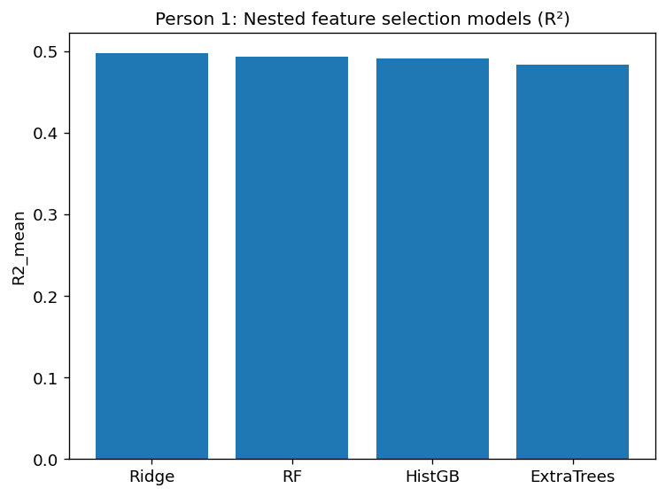
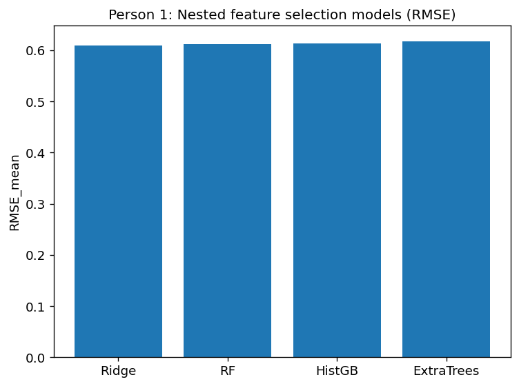
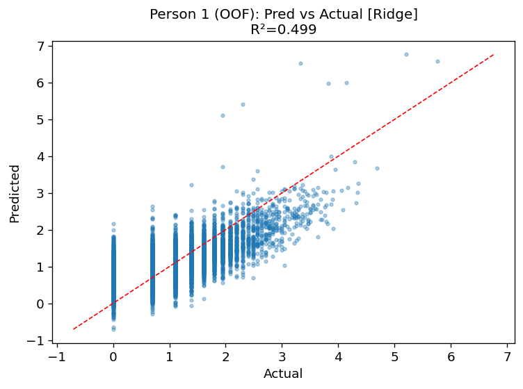
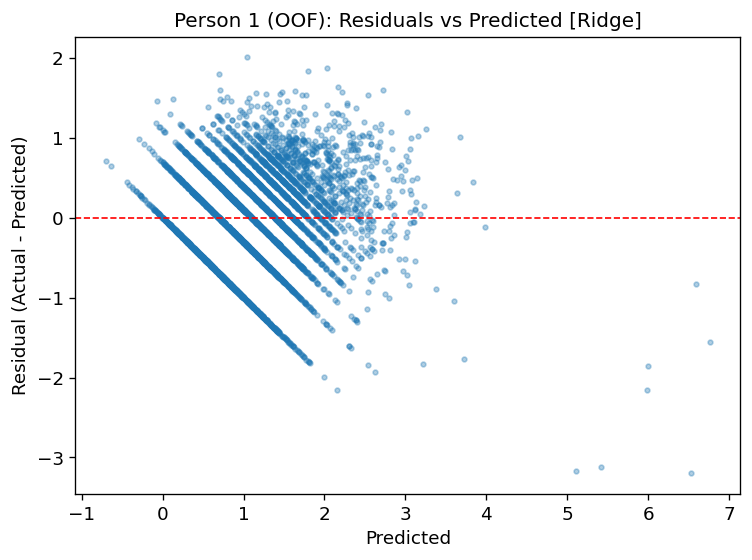
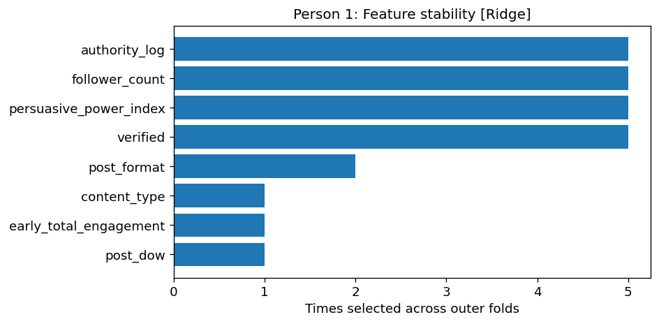

# Stage 1: Pre-visibility Prediction

## Overview
This stage investigates how early engagement signals (before algorithmic amplification) predict the success of social media content.

## Objective
To determine whether early user interactions can explain future high-effort engagement.

## Key Findings
- Early engagement signals are strong predictors of engagement success.
- The best-performing model (Ridge) achieved an R² of approximately 0.50.
- This indicates that early interactions explain nearly half of the variance in engagement outcomes.

## Interpretation
The results suggest that user-driven signals such as likes, comments, and engagement velocity play a dominant role in determining content success, even before algorithmic amplification occurs.

## Figures

### Model Performance (R² Comparison)

### Model Performance (RMSE)

### Prediction vs Actual

### Residuals

### Feature Stability

### Feature Importance

