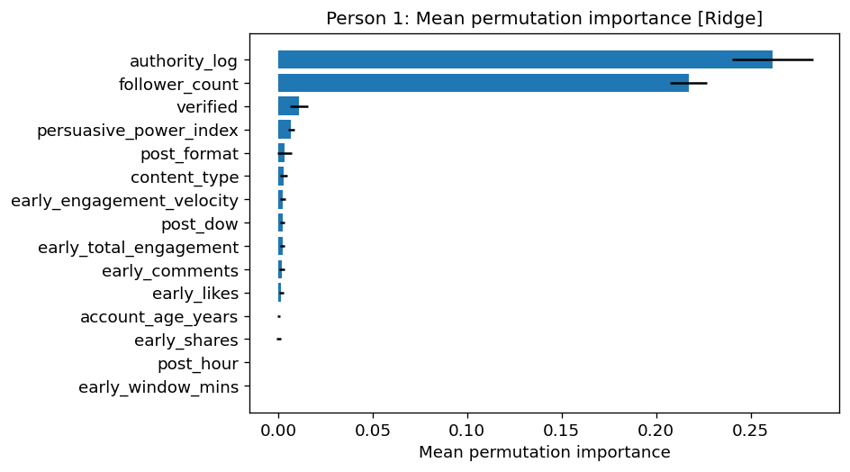
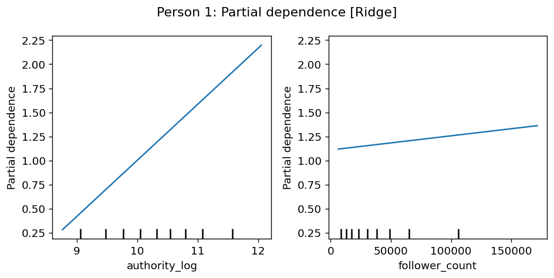
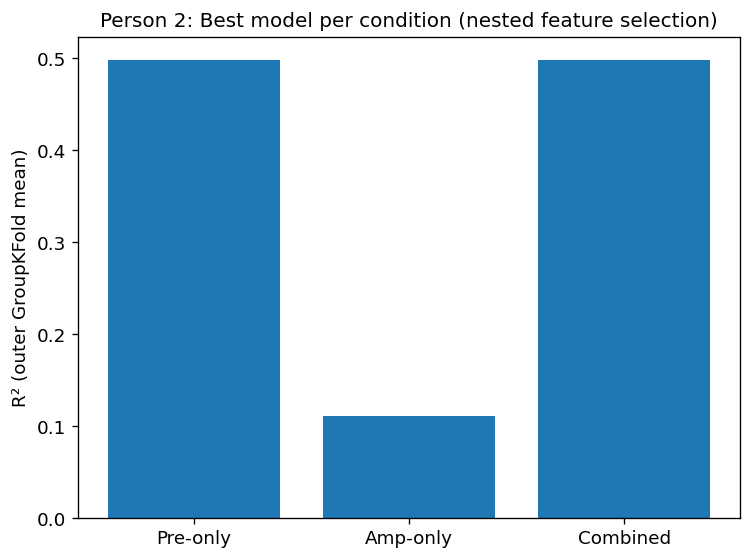
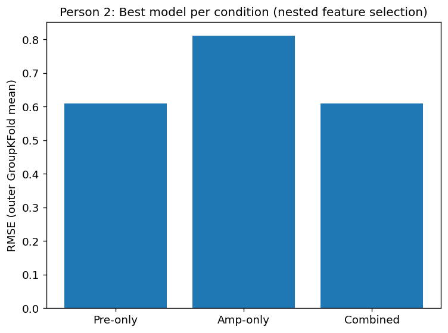
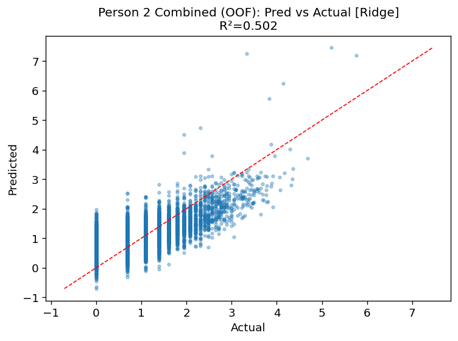

# Stage 2: Amplification vs Early Signals

## Overview
This stage compares the predictive power of early engagement signals and algorithmic amplification features.

## Objective
To evaluate whether algorithmic amplification adds predictive value beyond early user interactions.

## Key Findings
- The pre-only model achieved an R² of approximately 0.50.
- The amplification-only model achieved a significantly lower R² (~0.11).
- The combined model did not improve performance beyond the pre-only model.

## Interpretation
These results suggest that algorithmic amplification alone is a weak predictor of engagement success. Early engagement signals remain the dominant factor, and adding amplification features does not significantly improve model performance.

## Figures

### Model Comparison (R²)

### Model Comparison (RMSE)

### Combined Model Prediction

### Combined Model Residuals

### Feature Stability

