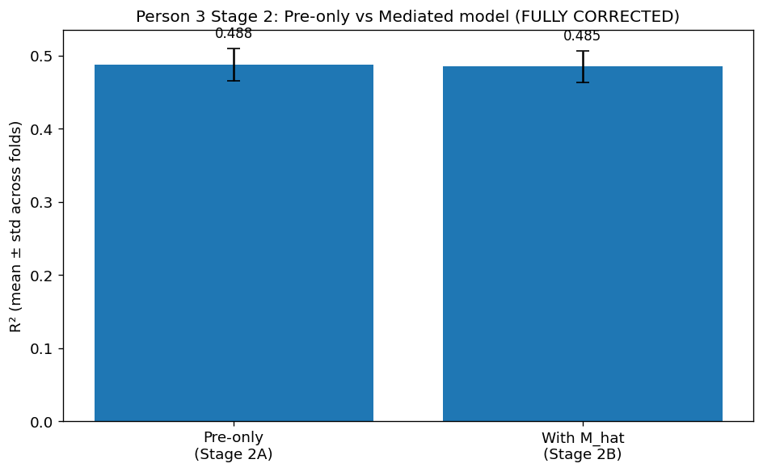
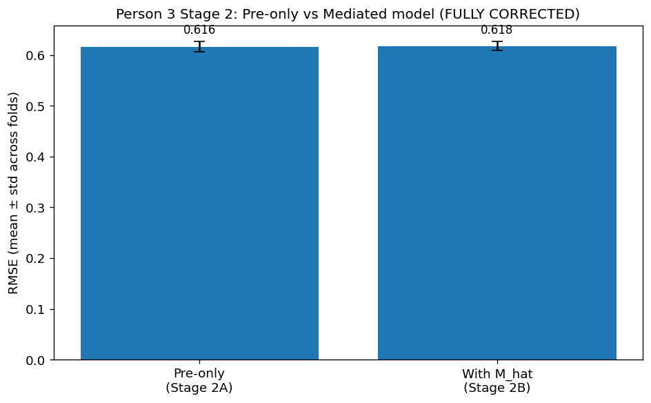
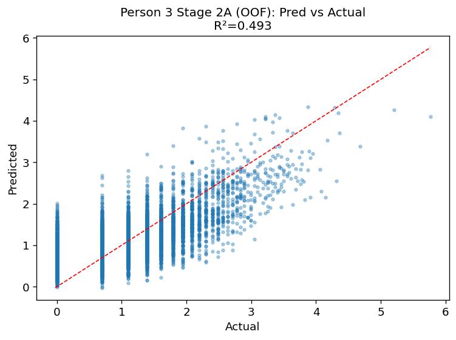
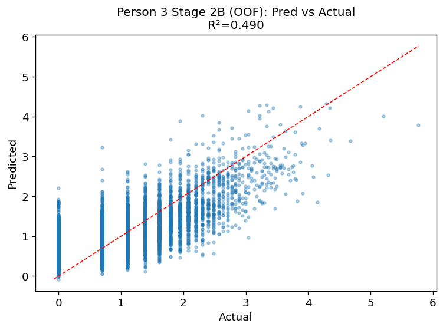
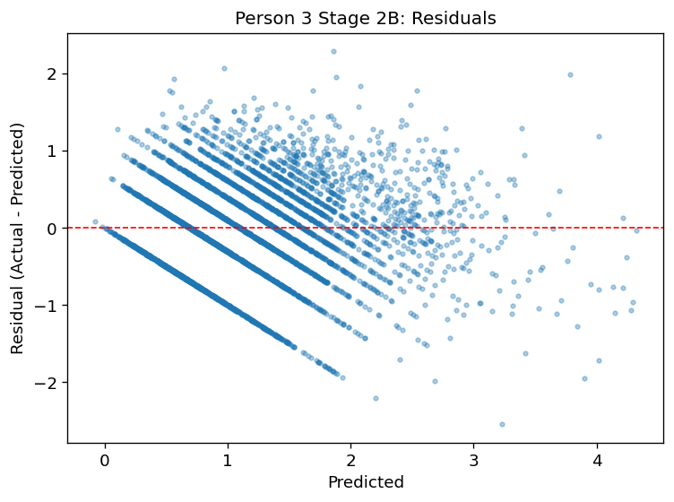
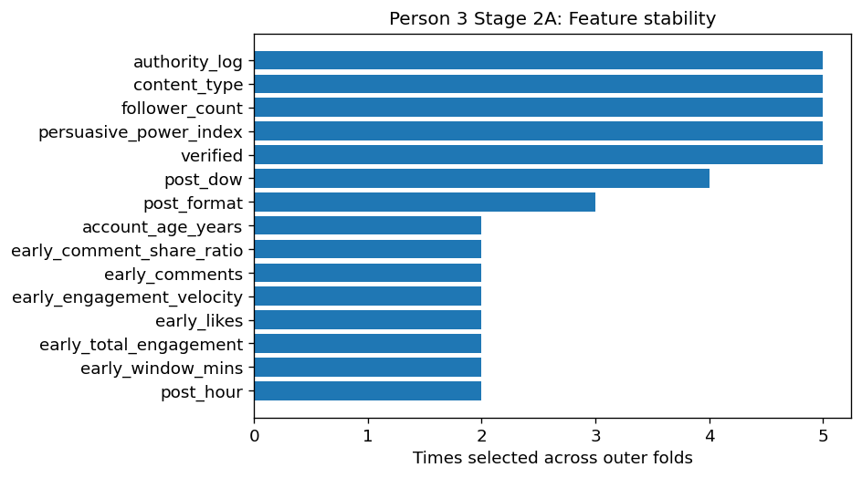
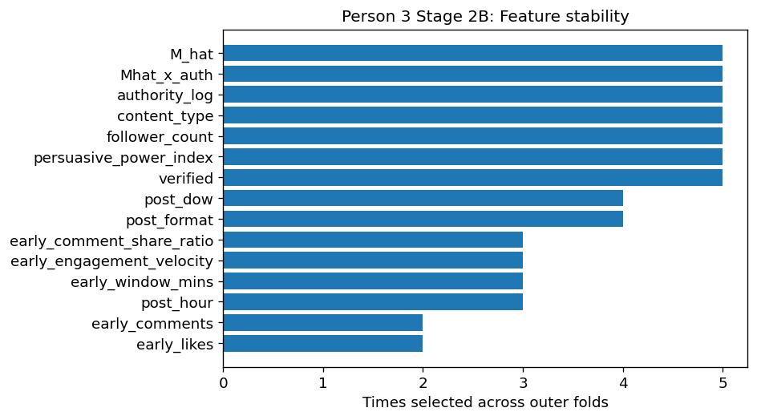

# Stage 3: Mediation Analysis

## Overview
This stage examines whether algorithmic amplification acts as a mediator between early engagement signals and final engagement outcomes.

## Objective
To determine whether amplification contributes indirectly to engagement success through a mediation effect.

## Key Findings
- The pre-only model achieved an R² of approximately 0.488.
- The model, including amplification as a mediator, achieved a similar R² (~0.485).
- There was no meaningful improvement in predictive performance.

## Interpretation
The results indicate that algorithmic amplification does not significantly mediate the relationship between early engagement signals and final outcomes. The predictive power remains primarily driven by early user interactions.

## Figures

## Figures

### Mediation Model Comparison (R²)

### Mediation Model Comparison (RMSE)

### Stage 2A Prediction

### Stage 2B Prediction

### Stage 2B Residuals

### Stage 2A Feature Stability

### Stage 2B Feature Stability

